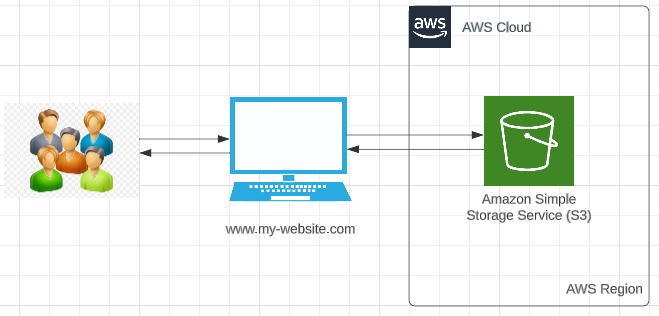

# Topic 2 - Https Static Website with a public DNS domain

###### Yuanchao Hands-on Project

###### Check this doc and project template on Github  [here](https://github.com/lyc-handson-aws/handson-topic2)

## **Overview** 

**Project's main features**

:point_right:  A static website

:point_right:  Static website has a accessible public domain

:point_right: Static website is protected by https

:point_right: Static website has a subdomain URL and a naked domain URL,  subdomain is redirected to naked domain

:point_right: Static Website URL [here](https://www.lyc-handson-aws.com)

## **Architecture**

the diagram below illustrates the architecture(principle) of this project:

## Continue Deployment

CloudFormation stack's deployment: see GitHub workflows of this GitHub repo https://github.com/lyc-handson-aws/handson-topic2/blob/main/.github/workflows/action-cf.yaml

Website static contents' delivery: see GitHub workflows of this GitHub repo https://github.com/lyc-handson-aws/handson-topic2/blob/main/.github/workflows/action-topic.yaml

## **CloudFormation Stack Quick-create Link**

Click here to quickly create a same project with the same AWS resources:  [here](https://us-east-1.console.aws.amazon.com/cloudformation/home?region=us-east-1#/stacks/create/review?templateURL=https://s3-lyc-handson-cfstacks.s3.eu-west-3.amazonaws.com/topic1.yaml)

**See Stack's description for complete actions to reproduce the same project**

> the default stack's region "Europe (Paris) eu-west-3"

## **AWS Resources**

Project's AWS resources:

:point_right: AWS S3 bucket

- AWS::S3::Bucket - create 2 buckets, one with website endpoint configuration for redirection, another with default configuration REST API(regional) endpoint. 
- AWS::S3::BucketPolicy -  Allow https access from Cloudfront user

:point_right: Amazon CloudFront

- AWS::CloudFront::Distribution - create a distribution for each domain for https' implementation 
- AWS::CloudFront::CloudFrontOriginAccessIdentity - identity used for accessing S3 Bucket

:point_right: AWS Certificate Manager 

- AWS::CertificateManager::Certificate -  generate a certificate used by CloudFront

:point_right: AWS Route 53

- AWS::Route53::HostedZone - create a DNS zone
- AWS::Route53::RecordSetGroup - create 2 DNS records for 2 domains pointed to each domain's CloudFront endpoint
